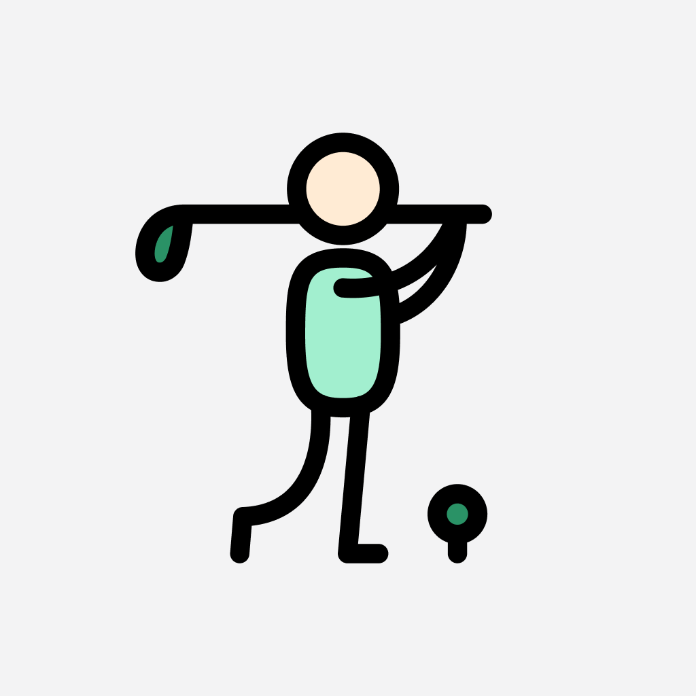
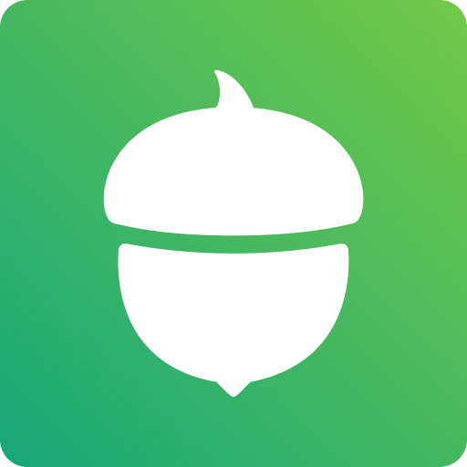

**dhour = Daniel + Hour**  
Former [sports industry](https://www.espn.com/blog/playbook/tech/post/_/id/3520/huskies-gift-players-custom-ncaa-covers) [professional](https://uclabruins.com/sports/2013/4/17/208189852.aspx).  
Left that world to make iOS apps 👨🏻‍💻.  
Former early employee @ [GOAT](https://apps.apple.com/us/app/goat-sneakers-apparel/id966758561).  
Now running [Destro Labs](https://destrolabs.xyz) & writing @ [Pixel Pushers](https://pixelpusher.club).

**You can find me in DTLA doing one of three things:**

```
- destro lab projects 🧑🏻‍🔬
- hanging w/ frank 🐶
- my golf swing ⛳️
```

<br>

## 🧑🏻‍💻 **dhour.codes (portfolio)**

<table>
  <tr>    
    <th align="left">App Title</th>
    <th align="left">Logo</th>
    <th align="left">Description</th>
  </tr>
  <tr>
    <td><a href="https://apps.apple.com/us/app/id6670567397">LUX - Sunscreen Tracking Game</a></td>
    <td></td>    
    <td>LUX is an app that gamifies sunscreen by using your Apple Health's Time in Daylight metric!</td>    
  </tr>
  <tr>
    <td><a href="https://apps.apple.com/us/app/id6503170201">Hacks - Sim Golf Journal</a></td>
    <td></td>    
    <td>Hacks is a sim golf swing journal! It's an app for the golfer that wants to document their swing evolution with video, stats, and notes but not blast it all over social media.
</td>    
  </tr>
  <tr>
    <td><a href="https://apps.apple.com/us/app/id6469011331">Pixelfits - Virtual Fittings</a></td>
    <td></td>    
    <td>Your virtual 2D Fitting Room! Our app lets you share tops, bottoms, or sneakers from your mobile browser and "try on" anything you come across while shopping online.</td>    
  </tr>
  <tr>
    <td><a href="https://apps.apple.com/us/app/hodinkee/id1008305274">Hodinkee</a></td>
    <td></td>    
    <td>HODINKEE is a comprehensive, award-winning online magazine covering wristwatches of a particularly high quality.</td>    
  </tr>
  <tr>
    <td><a href="https://apps.apple.com/us/app/goat-sneakers-apparel/id966758561">GOAT</a></td>
    <td></td>    
    <td>GOAT is the global platform for the greatest products from the past, present and future.

</td>    
  </tr>
  <tr>
    <td><a href="https://apps.apple.com/us/app/acorns-invest-spare-change/id883324671">Acorns</a></td>
    <td></td>    
    <td>Acorns helps you save & invest. Invest spare change, bank smarter, earn bonus investments, and more.</td>    
  </tr>
</table>

<br>

## ✍🏻 **dhour.writes (substack)**

[I write stories about my [mis]adventures as an iOS developer](https://pixelpusher.club), and I ~~sometimes~~ often post photos of my dog Frank 🐶 in the Notes.

<!-- | Title                                                                                                                 | Description                                                                                                                                                                                                                                                                                                           |
| :-------------------------------------------------------------------------------------------------------------------- | :-------------------------------------------------------------------------------------------------------------------------------------------------------------------------------------------------------------------------------------------------------------------------------------------------------------------- |
| [Career Timeline](/blog/my-career-timeline/post.md)                                                                   | A "big-picture" approach to keep track of the left & right turns in my career so far. From collegiate golf to million dollar bowl game budgets to tech industry vet. It's been an odd journey and it's fun to look back on it & remember what I've done.                                                              |
| [Teaching Myself How to Code](/blog/teaching-myself-how-to-code/post.md)                                              | I’ve been asked more than a few times about how I engineered such a wide left turn in my career. I decided it would be more impactful to put the story down in writing.                                                                                                                                               |
| [The Sneaker Contest Reimagined](https://medium.com/goatgroupengineering/the-sneaker-contest-reimagined-71a4e2f5aa0d) | GOAT’s Black Friday contest is the largest digital sneaker event of the year. We hosted our first Black Friday drawing in 2015, just a few months after we launched the GOAT app.                                                                                                                                     |
| [Serverless Bookmarks on iOS](/blog/serverless-bookmarks-on-ios/post.md)                                              | Bookmarks & Favoriting - an essential tool for both shoppers and retailers in the world of e-commerce. But what if there isn't enough time to spin up an entire backend service for it?                                                                                                                               |
| [Introducing Pixelfits](/blog/introducing-pixelfits/post.md)                                                          | The idea blossomed when Apple opened up its “subject lifting” API, which magically lifts subjects out of images through a touch & hold interaction.                                                                                                                                                                   |
| [Why Design Matters](/blog/why-design-matters/post.md)                                                                | I get that the topic of design's importance in tech isn't exactly breaking news, but I really think the story of how Pixelfits evolved is something special. It's also a bit of a personal journey for me – from a dismissive "design, schmesign" attitude to a full-on "aha, so this is what it's all about" moment. |
| [Exploring New APIs w/ Pixelfits](/blog/exploring-new-api/post.md)                                                    | Whenever inspiration strikes for a new app, I blend the latest Apple APIs with technologies unexplored in my day job. This approach sharpens my skills, keeping me engaged with the evolving iOS landscape and its array of new tools.                                                                                | -->

<br>

## 🧑🏻‍🔬 **dhour.biz (consulting)**

[Destro Labs](https://destrolabs.xyz) provides digital solutions for small business owners. You can visit [https://destrolabs.xyz](https://destrolabs.xyz) to learn more!

<br>
<br>

## 👾 **tech.stack**


<!--
**danielhour/danielhour** is a ✨ _special_ ✨ repository because its `README.md` (this file) appears on your GitHub profile.

Here are some ideas to get you started:

- 🔭 I’m currently working on ...
- 🌱 I’m currently learning ...
- 👯 I’m looking to collaborate on ...
- 🤔 I’m looking for help with ...
- 💬 Ask me about ...
- 📫 How to reach me: ...
- ⚡ Fun fact: ...
-->
