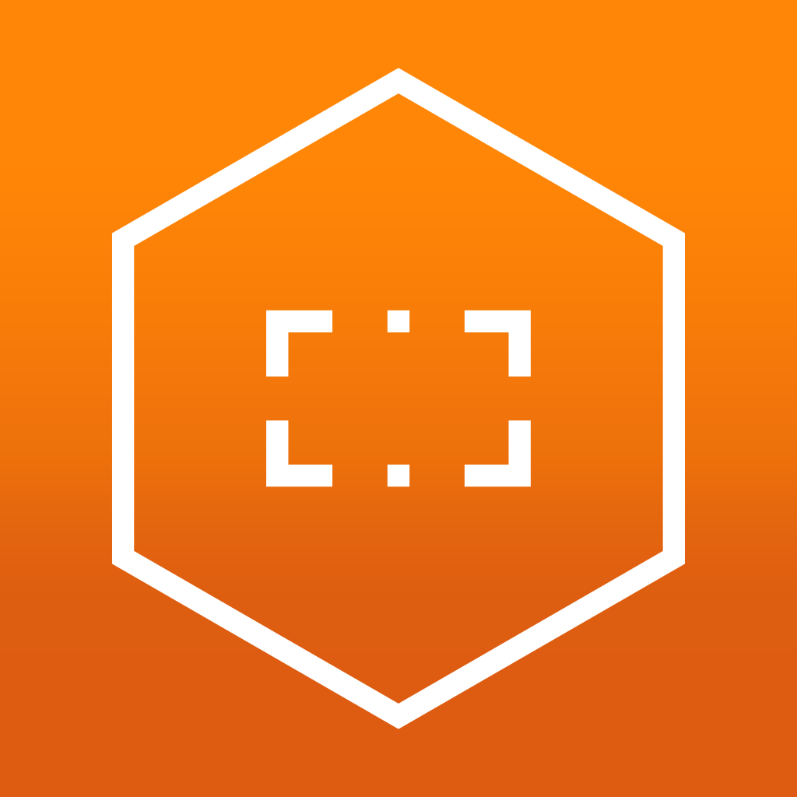
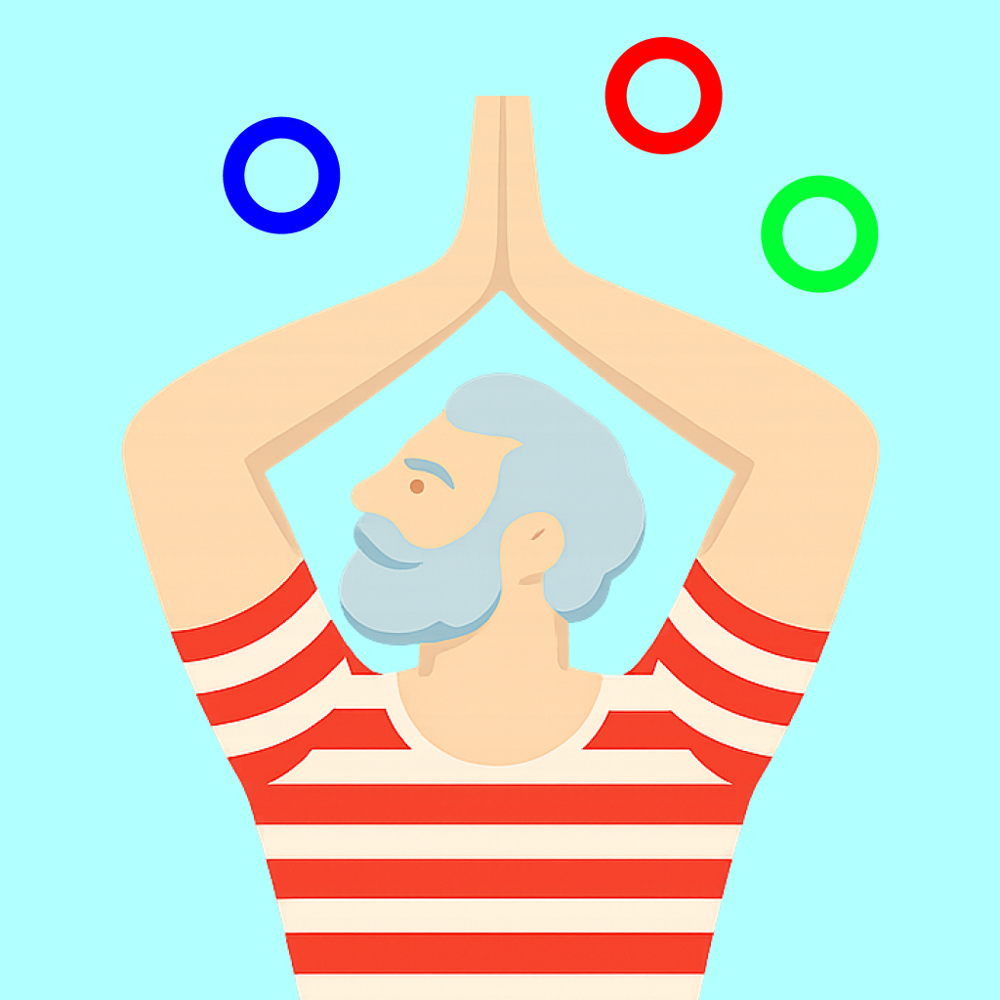
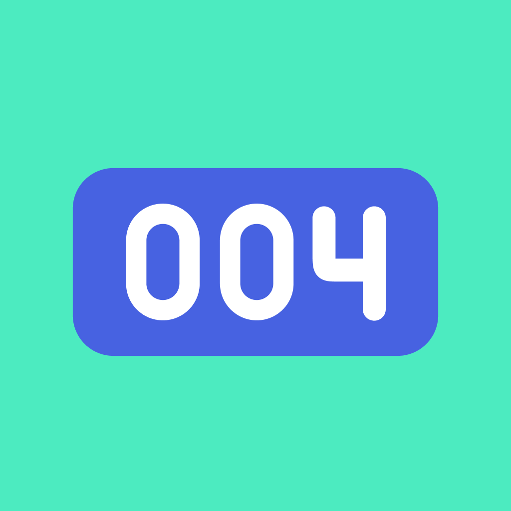
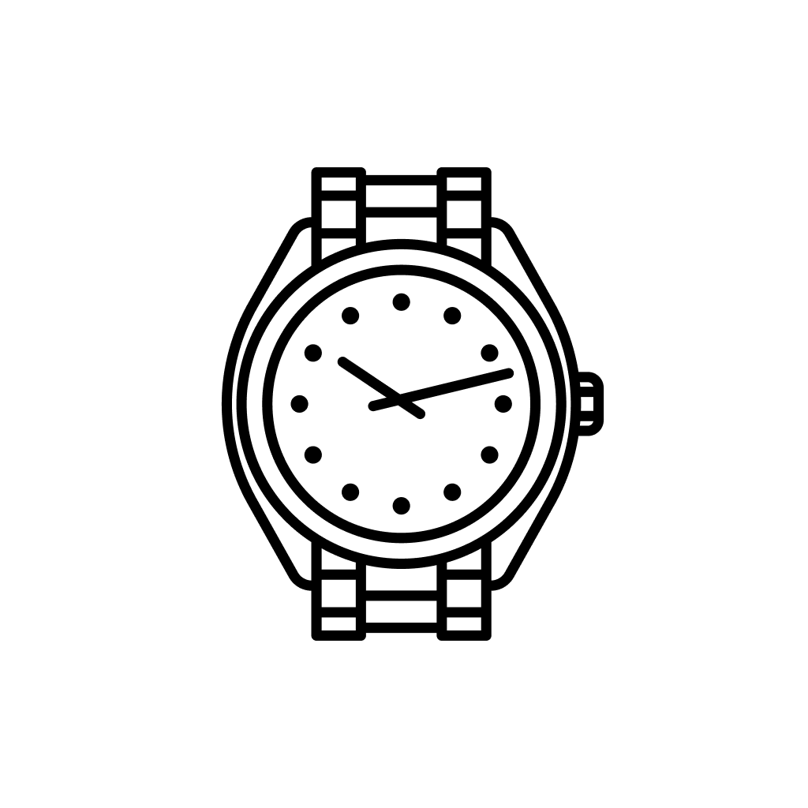
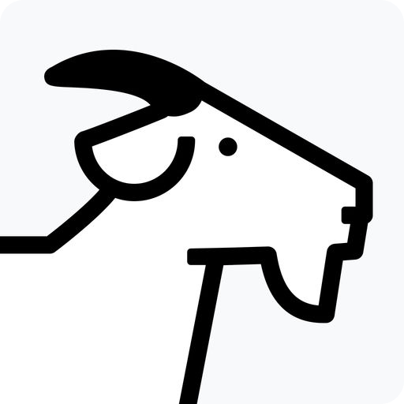

**dhour = Daniel + Hour**  
Former [sports industry](https://www.espn.com/blog/playbook/tech/post/_/id/3520/huskies-gift-players-custom-ncaa-covers) [professional](https://uclabruins.com/sports/2013/4/17/208189852.aspx).  
Self-taught iOS Developer since 2014 👨🏻‍💻.  
Former early employee @ [GOAT](https://apps.apple.com/us/app/goat-sneakers-apparel/id966758561).  
Now running [Destro Labs](https://destrolabs.xyz).

**You can find me in Los Angeles doing one of three things:**

```
- coding 🧑🏻‍🔬
- renovating 🏡
- dog-parenting 🐶
```

<br>

## 🧑🏻‍💻 **dhour.codes (portfolio)**

<table>
  <tr>
    <th align="left">App Title</th>
    <th align="left">Logo</th>
    <th align="left">Description</th>
  </tr>
  <tr>
    <td><a href="https://apps.apple.com/us/app/artemis-directors-viewfinder/id1164523253">Artemis Pro</a></td>
    <td></td>
    <td>Professional filmmaking app for cinematographers and directors to preview shots using real camera and lens data.</td>
  </tr>
  <tr>
    <td><a href="https://apps.apple.com/us/app/childish-folly/id6747728050">Childish Folly</a></td>
    <td></td>
    <td>The Severance ring toss game - Miss Huang approved for unwinding or testing your precision.</td>
  </tr>
  <tr>
    <td><a href="https://apps.apple.com/us/app/4-count-wrist-metronome/id6742166219">4 Count | Wrist Metronome</a></td>
    <td></td>
    <td>A haptic metronome for your Apple Watch that keeps you locked into proper tempo during Lagree workouts.</td>
  </tr>
  <tr>
    <td><a href="https://apps.apple.com/us/app/id6670567397">spf.today</a></td>
    <td></td>
    <td>Build consistent sunscreen habits with effortless tracking and intelligent reminders.</td>
  </tr>
  <tr>
    <td><a href="https://apps.apple.com/us/app/wristcheck-try-on/id6737742550">WristCheck Try-On</a></td>
    <td></td>
    <td>Virtually try on luxury watches at home with Apple Vision Pro.</td>
  </tr>
  <tr>
    <td><a href="https://apps.apple.com/us/app/hodinkee/id1008305274">Hodinkee</a></td>
    <td></td>
    <td>HODINKEE is a comprehensive, award-winning online magazine covering wristwatches of a particularly high quality.</td>
  </tr>
  <tr>
    <td><a href="https://apps.apple.com/us/app/goat-sneakers-apparel/id966758561">GOAT</a></td>
    <td></td>    
    <td>GOAT is the global platform for the greatest products from the past, present and future.

</td>    
  </tr>
</table>

<br>

## ✍🏻 **dhour.writes (pixelpushers.club)**

I write stories about my [[mis]adventures](https://pixelpusher.club) as an iOS developer.

**Most Popular:**

**[I forced myself to spend a week in Instagram instead of Xcode](https://www.pixelpusher.club/p/i-forced-myself-to-spend-a-week-in)**<br>
— _Featured on [Hacker News](https://news.ycombinator.com/item?id=45322819) & [iOS Dev Weekly](https://iosdevweekly.com/issues/727/)_

**[I turned the Water Ring Toss game from _Severance_ into an app](https://www.pixelpusher.club/p/introducing-childish-folly)**<br>
— _Severenace Prop Master & Miss Huang approved_

<br>

## 🧑🏻‍🔬 **dhour.mentors (for non-technical founders)**

[Growth Mentor](https://growthmentor.com) connects startup founders with experienced mentors for 1-on-1 advice. My strength, on this platform, is in helping non-technical founders not get screwed.

I joined Growth Mentor because I got sick of [watching friends get ripped off](https://www.pixelpusher.club/p/am-i-crazy-or-does-my-engineering) by dev shops and underperforming engineering teams. So I decided to do something to help non-technical founders spot red flags early. I do this by vetting dev shops | reviewing code | sanity-checking the output.

[Book a session](https://app.growthmentor.com/mentors/daniel-hour-1?ref=2827c56537).

<br>
<br>

## 👾 **tech.stack**


