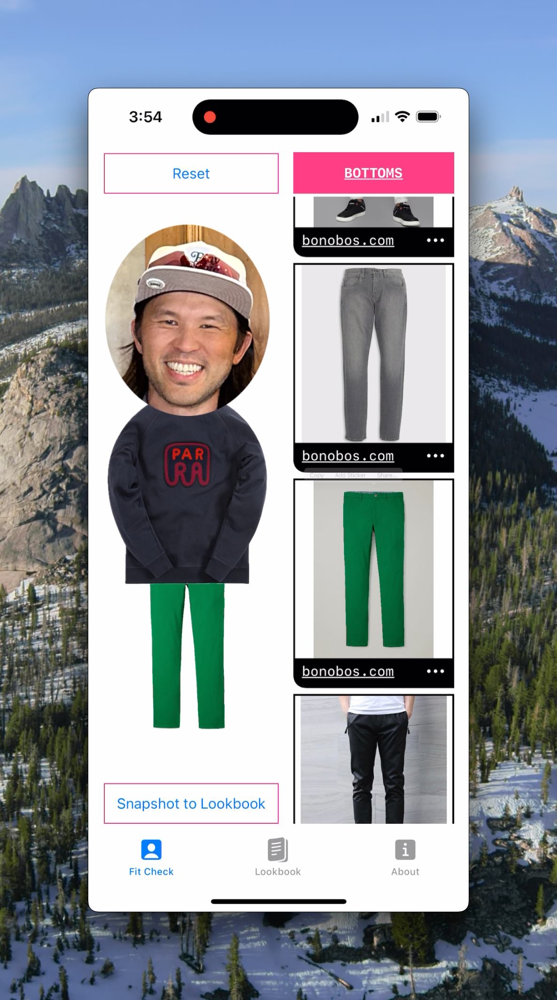
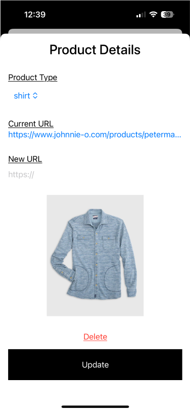
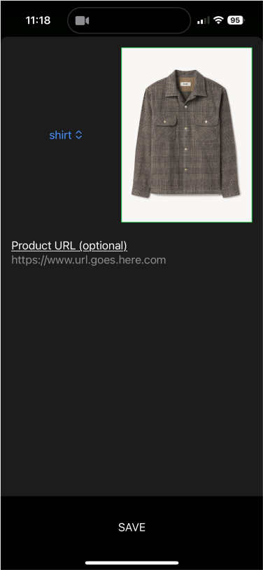

# Why Design Matters

####

I get that the topic of design's importance in tech isn't exactly breaking news, but I really think the story of how [Pixelfits](https://apps.apple.com/us/app/id6469011331) evolved is something special. It's also a bit of a personal journey for me – from a dismissive "design, schmesign" attitude to a full-on "aha, so this is what it's all about" moment.

So, [Pixelfits](https://apps.apple.com/us/app/id6469011331) started its life as "Lo-Fi Fit Checks," a name as clunky as its initial design. Sure, it was a functional MVP, but let's just say it wouldn't win any beauty contests. The thought of releasing it into the wild was okay only if I didn't charge a dime for it. I mean, asking folks to fork over cash for something that janky? That just didn't sit right with me, and slapping my name on it felt like lowering my own bar.

Usually, I'm a lone wolf on my indie projects, but this time around, I decided to shake things up by teaming up with a designer. I've had my share of run-ins with designers who treat every pixel like it's sacred, but I knew things would be different with [Alex Fortney](https://www.alexmakesthings.co/), a design pal from my Hodinkee days.

I knew she wasn't about just passing off designs for me to build – she was all in for a real collaboration. I knew this from experience so I knew we'd enjoy iterating on it together (if she was up for this quirky project). So, I pitched her the rough-around-the-edges prototype and suggested we team up 50/50 to give [Pixelfits](https://apps.apple.com/us/app/id6469011331) the glow-up it deserved. And guess what? She was totally on board!

Now, here we are! I'm super excited for you to check out [Pixelfits](https://apps.apple.com/us/app/id6469011331) and see the amazing transformation. But first, take a gander at the original designs I've got here. They're a bit of a chuckle and a solid reminder to my fellow devs: team up with a designer you click with. It's a game-changer, trust me. 😂

